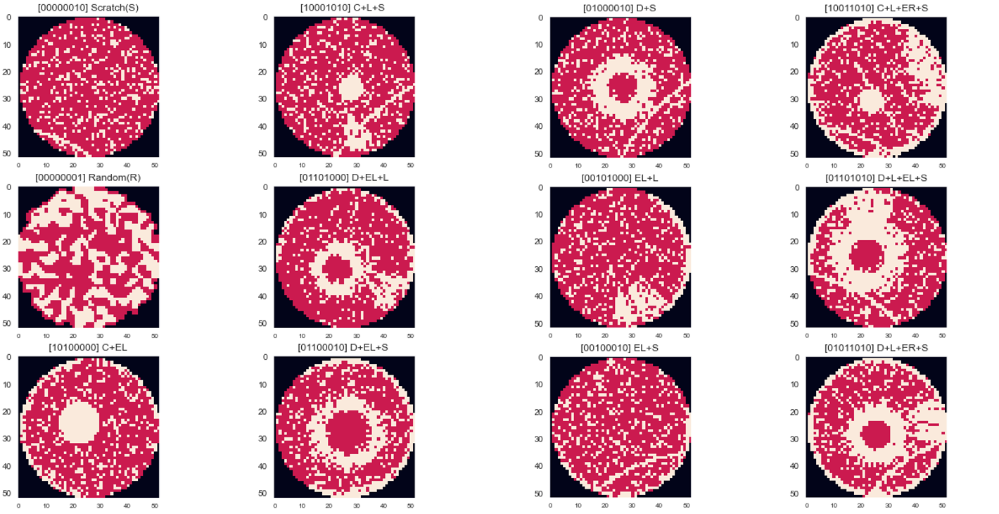
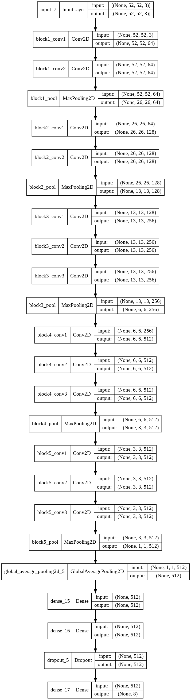
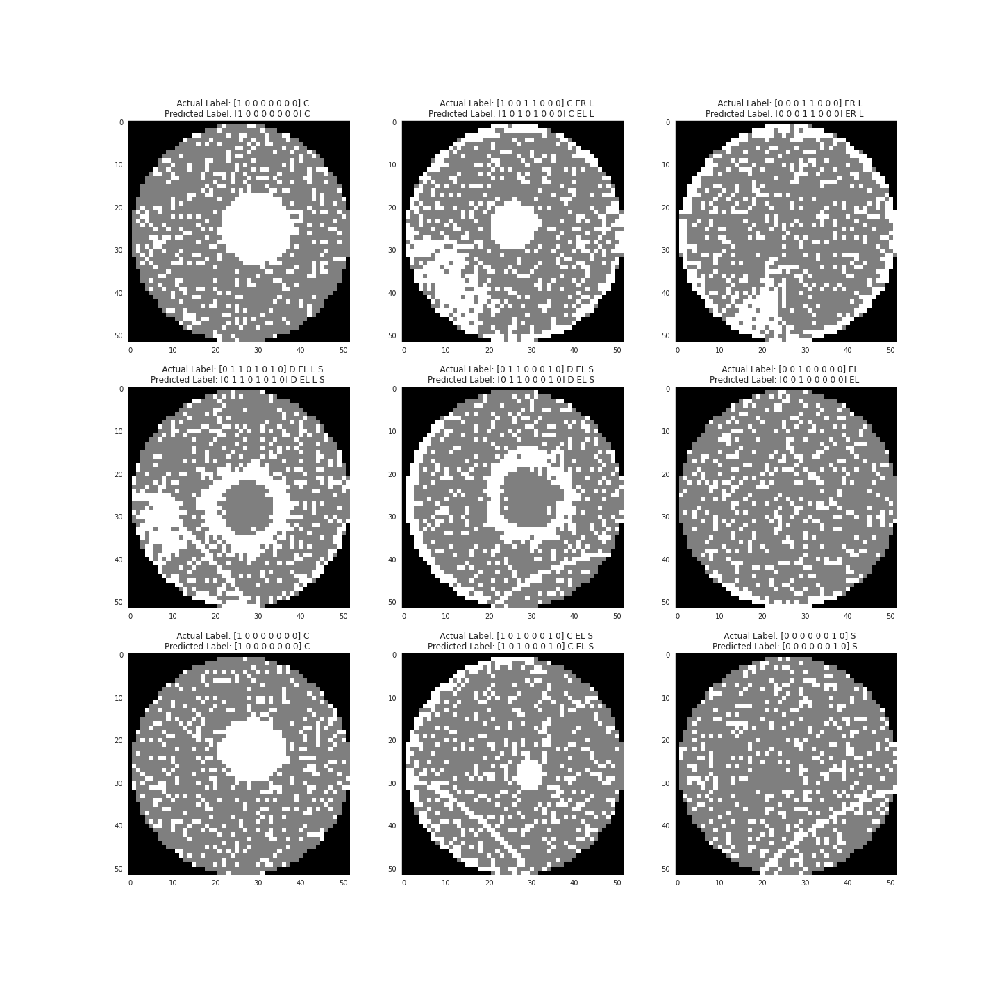
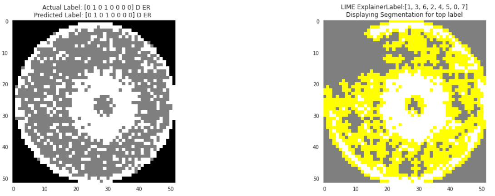

# Wafer Map Mixed-Type Defect Pattern Multi-Label classification

## Introduction

During Semiconductor manufacturing one of the major cause for yield loss is due to the errors from Process/tools. So identifying these fabrication errors in shorter time is crucial in improving the yield and throughput of the Fab.

At the end of the Fabrication, the wafers/ICs are tested electrically and binned as Pass or Fail chips. Wafer Bin Maps are generated based on the Pass and Fail information. Failing ICs Defect pattern on the Wafer Bin Map provides the significant information on the root cause of the Failures. Defect patterns relates to the different Fabrication errors. 

Example: Scratch Pattern on the Wafer Bin Map is likely due to the Handling Issues and Localized Pattern is likely due to the Uneven cleaning during Process.

Wafer Map Defect Pattern Classification plays a key role in identifying root causes and yield Enhancement. Increase in complexity of Fabrication process also increases in mixed-type defect patterns. 

This Capstone Project focuses on developing Deep Learning Image Classification model for classifying Mixed type Wafer Map defect patterns.

## Objective

To build a Deep Learning based Image Classifier model for Wafer Map Mixed-type Defect Pattern Multi-Label Classification which,

-  Is Less complex (takes less training time)
-  Achieves minimum 90% Overall Accuracy
-  Achieves minimum 90% Precision/Recall/F1-scores for each individual defects

## Machine Learning Process

Machine Learning Workflow used for this project is:

- **Gathering Data**

- **Data Preprocessing (Data Cleaning, EDA and Feature Engineering)**

- **Modeling (Model Building, Training, Fine Tuning/Hyper Parameter Tuning)**

- **Model Evaluation**

  

## Gathering Data

Obtained the public data set from Kaggle.

[Mixed-type Wafer Defect Datasets by Institute of Intelligent Manufacturing, Donghua University](https://www.kaggle.com/co1d7era/mixedtype-wafer-defect-datasets)

- It has 38,000 Wafer Map Images
- Individual Defects patterns are **Center, Donut, Localized Edge, Ring Edge, Localized, Near Full, Scratch and Random**
- There are 38 Mixed defect types in total
  - 1 Normal
  - 8 Single Defect 
  - 28 Mixed (2 defects, 3, defects, 4 defects)

## Data Preprocessing

- Replaced Invalid pixel values
- Normalized the Image data
- Calculated Class weights
- Converted to RGB representation
- Stratified split: 50% in Train set, 25% in Validation set, 25% in Test set

As can see from the sample Images below, the same type of defect can be at different size/position/angle. The Classification Model need to recognize this complex multi-angle/location and multiple patterns

## Model Building and Fine tuning/Hyper parameter tuning

- Model
  - Chose VGG16net, an innovative and commonly used Image recognition architecture, as the base model
    - Convolution stacks: Convolution layers (Filter size 3 x 3, Stride 1 and Padding 1) + Max-pooling layer (size 2 x 2)
  - Creating the full model VGG16 model by connecting 3 fully connected layers to the VGG16 base model
    - Added in **GlobalAveragePooling2D** before the Fully connected Dense layers to convert multi dimensional object to one dimensional. Its expected to perform better than the Flatten layer
    - A **drop out layer** before the output layer
    - Since its a Multi-Label classification (i.e each pattern in the Image need to be individually classified) problem for Output dense Layer used **Sigmoid** activation. Sigmoid squashes a vector of range (0,1) for each of the 8 outputs
- Loss type: Since its the Multi-Label Classification used **BinaryCrossentrophy** as the loss type. Loss computed for every vector is not affected by other component values. 
- Metric Type: **BinaryAccuracy**
- Addressed Data Imbalance by Class weights would provide a weight or bias for each output class (individual defects)

After fine tuning/hyper parameter tuning, chose the final model parameters.

- **Dropout rate: 0.5**
- **Learning rate: 0.0001**
- **Kernel regularizer: L2(penalty= 0.0001)**

## Model Evaluation

- Evaluation Metrics for overall performance: AccuracyScore/Exact Match Ratio and Hamming Loss
  -  [Exact Match Ratio: Percentage of samples that have all their labels classified correctly.](https://towardsdatascience.com/journey-to-the-center-of-multi-label-classification-384c40229bff)
  -  [Hamming-Loss: Fraction of labels that are incorrectly predicted](https://towardsdatascience.com/journey-to-the-center-of-multi-label-classification-384c40229bff)
- Evaluation Metrics for Individual defects: Precision/Recall/F1 score and ROC_AUC score

### Sample Images with True and Predicted Labels

- Above Images clearly shows that True labels and Predicted Labels are accurate for different defects and mixed patterns too

### Sample Images with the LIME explainer segmentation mask

In this Image top label is the Donut(D)

- LIME Segmentation Image on the right clearly shows that the model is able to identify the shape of the Donut(D) well and so can predict it correctly

  

# Results and Conclusions

- The Multi-Label Classification model developed with VGG16 architecture is Classifying the Mixed-Type Defect Pattern of the WaferMap with the over all AccuracyScore/ExactMatchRatio of 95% and Hamming loss very low (~0.006%) on the Test set

- False Positives and False Negatives are less than 1% for all the Individual defects (classes)

- Achieved Precision/Recall/F1-score > 90% for each of the Individual defects indcuding the defect with less count

- LIME explanier segmentation masks shows that the model is able to identify the shape of the patterns well

  

# Future Work

- As the complexity of the process keep increasing constantly with the advancement in technology, there are high possibility to encounter new defect patterns. So as a future work plan to develop Image segmentation model to detect new patterns and integrate with the Multi-Label Classification model
